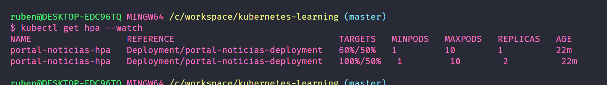

# Kubernetes Learning


### Order to have a Entire Cluster K8s

config-map > svc > pvc > deployment/stateful-set

### ConfigMap

Set all the environment variables for a application.

### Service (SVC)

Used to load balancer the application.

### PersistentVolumeClaim

Create a resource to your pv, if you don't have any sc (StorageClass) it will use the default one.

### Deployments/StatefulSet

Good to have many pods (Applications)

#### Utils

#### Liveness Probe

It's used to see if the application is working correctly

#### Readiness Probe

It's used to see if the application is ready to receive requests

## Horizontal Pod Autoscaler

In case you need to scaler your application in a automated way. This will auto scaler your app based in your config of cpu utilization or memory utilization.

##### Images in progress

*Scalling*

<p align="left">
  
</p>

*Reducing when it does not need*

<p align="left">
  
</p>

##### HPA Warning

Don't forget to set the resources in the deployment yml file in the `containers` area.

```yml
resources:
  limits:
      cpu: 10m
      memory: 1Gi
  requests:
    cpu: 10m
```


## VerticalPodAutoscaler

It is possible to scale with not setting the resources (limits/requests) of system, you can use it to make to you.

In case you want to learn how to do it, you can check this link 

[vertical-pod-autoscaler GitHub Documentation](https://github.com/kubernetes/autoscaler/tree/master/vertical-pod-autoscaler)